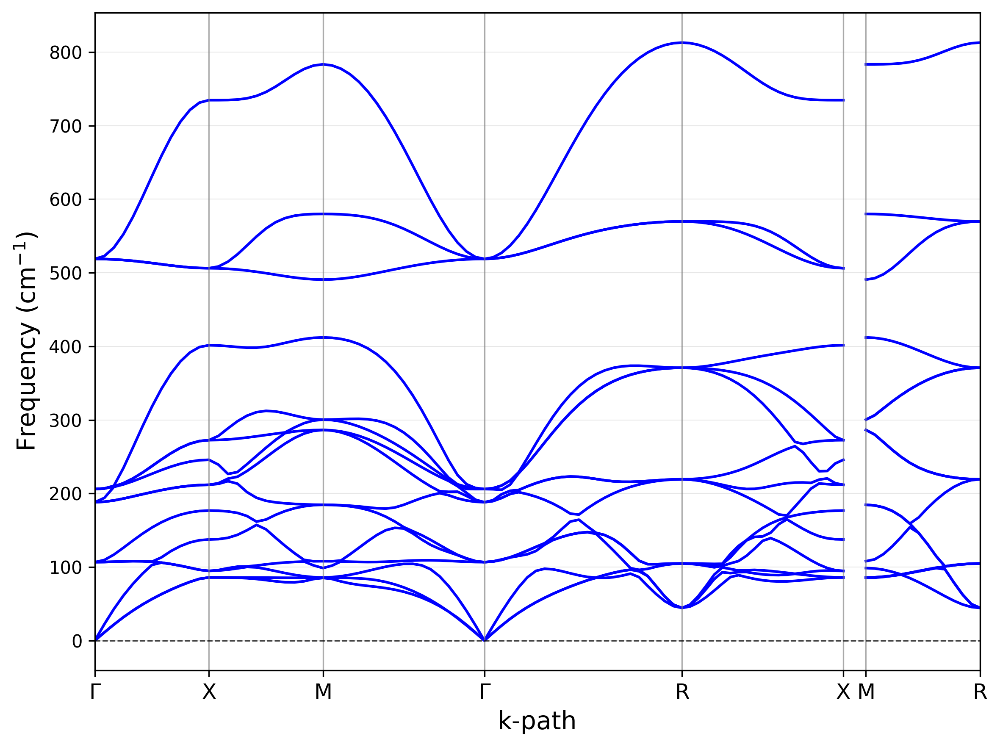

# MULTIBINIT Integration

AtomChain supports using MULTIBINIT effective potentials as calculators for structure relaxation and phonon calculations.

## Configuration File

MULTIBINIT requires a configuration file to specify input files and parameters.

Minimalist configuration file example (`config.conf`):

```ini
[files]
ddb_file = BaHfO3_DDB
sys_file = BaHfO3.xml

[parameters]
# Supercell size (must match input structure size). 
# Important: this must be consistent with the size of the supercell used in the calculation.
ncell =  2 2 2
# Q-point grid (must match DDB generation)
ngqpt = 4 4 4
# Dipole-dipole interactions
dipdip = 1

[backend]
auto_match_atoms = true
match_tolerance = 0.1
```

## CLI Usage

You can use the `mlrelax` and `mlphonon` tools with MULTIBINIT by specifying the model type and path to the configuration file.

### Relaxation

```bash
mlrelax input.vasp --model multibinit --model_path config.conf --output_file relaxed.vasp
```

### Phonon Calculation

```bash
# ndim is the supercell size for phonon calculation
mlphonon input.vasp --model multibinit --model_path config.conf --ndim 2 2 2 --figname phonon.pdf
```

### Output Example

The phonon calculation produces a band structure plot. You can control the output format by the file extension (e.g., `.pdf`, `.png`).



*Note: The actual output will be a phonon band structure plot, similar to standard Phonopy output.*
